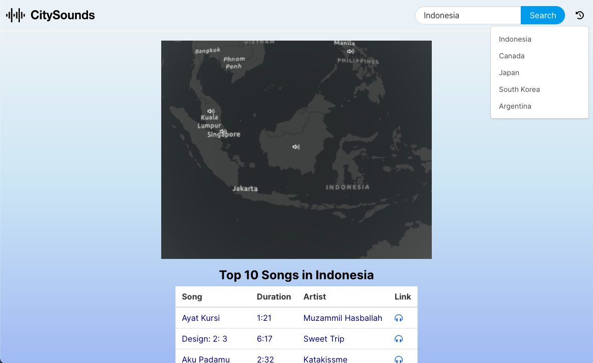

# Template Repo

## Description

Our team's motivation for creating this application was to apply a culmination of our knowledge thus far in our bootcamp. That includes HTML, CSS, JavaScript, third-party APIs, and most recently, Git. Each team member wanted to exercise their strengths and improve upon other skills. All of us used this project as an opportunity for teach-backs and, in turn, to learn more about areas of programming that we haven't explored deeply yet. 

In the beginning, our goal was to create an impressive end product that we could realistically use and be proud to display in our portfolios. The process of brainstorming, planning, and developing our app was important in our decidion making process. We decided that it was much better to deliver a polished MVP that we could knowingly develop given the time constraints, than overshoot our goal for the time and resources currently available to us. We gained invaluable experience working in Github collaboratively, using Git to push code made in branches, pull from the main repo, and merge pull requests to remain in sync with one another. Throughout development, we learned the importance of communication. While a team member works on one function, another person's area of the application may depend on variables defined in that function. Changing even the smallest lines of code could have large scale impacts. Each of us learned about different areas of coding from various team members. 

Despite realizing we could not add every bell and whistle we originally wanted, our team is proud to deliver the final app we have. CitySounds allows people to search by country for the top ten songs in 69 nations with a sleek, easy to navigate user interface. 

- What was your motivation?
- Why did you build this project? (Note: the answer is not "Because it was a homework assignment.")
- What problem does it solve?
- What did you learn?

## Table of Contents (Optional)

If your README is long, add a table of contents to make it easy for users to find what they need.

- [Installation](#installation)
- [Usage](#usage)
- [Credits](#credits)
- [License](#license)

## Installation 

What are the steps required to install your project? Provide a step-by-step description of how to get the development environment running.

## Usage

Before using this application, please [click here](https://cors-anywhere.herokuapp.com/corsdemo) initialize our proxy server in order to access Deezer's (our music API's) data!

Upon the landing page loading, simply type a country name into the search bar in the top right corner. Click the autofill option, then click search Clicking search will show you the current top ten songs in that country!

To view the top ten songs from a country you have previously searched, click the recent searches icon    in the upper right corner.

## Credits

List your collaborators, if any, with links to their GitHub profiles.

If you used any third-party assets that require attribution, list the creators with links to their primary web presence in this section.

If you followed tutorials, include links to those here as well.

## License

Please see the repo for license info.

## Badges

Badges aren't necessary, but they demonstrate street cred. Badges let other developers know that you know what you're doing. Check out the badges hosted by [shields.io](https://shields.io/). You may not understand what they all represent now, but you will in time.

## Features

If your project has a lot of features, list them here.

## How to Contribute

If you created an application or package and would like other developers to contribute to it, you can include guidelines for how to do so. The [Contributor Covenant](https://www.contributor-covenant.org/) is an industry standard, but you can always write your own if you'd prefer.

## Tests

Go the extra mile and write tests for your application. Then provide examples on how to run them here.
